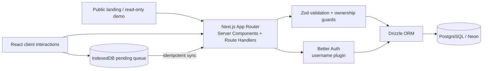
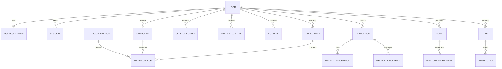
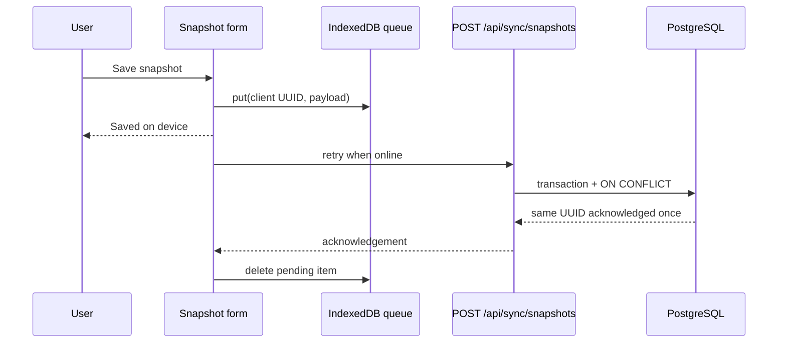

# StateFlow


StateFlow is a privacy-first longitudinal tracker for the many independent dimensions of a person’s mental and emotional state. It separates current pleasure from future wanting, energy from activation, and achievement from stimulation—then relates those observations to sleep, caffeine, activities, goals, medication history, and life context.

It is a self-observation and research tool, **not a diagnostic or emergency-monitoring service**.

## Why I built it

A single “mood: 1–10” score erases useful distinctions. Someone can enjoy the current moment while feeling little pull toward their future; have energy without pleasure; or feel mastery after a difficult day. StateFlow stores these dimensions independently so weeks and years of data remain useful.

The project is also a production-oriented full-stack case study: multi-user authorization, normalized time-series data, offline idempotent writes, descriptive statistics, timezone-aware context, installable PWA behavior, synthetic demo data, and privacy-preserving exports.

## Features

- 15–30 second Quick Snapshots with exact timestamps, context tags, notes, and important moments.
- Detailed Daily Check-in with autosaved device-local drafts.
- Separate scales for Future Wanting, Pleasure, Anticipation, Energy, Activation, Mastery, Pride, Escape Urge, and other core metrics.
- Sleep records with derived duration, time in bed, and midpoint; caffeine records with precise time and dosage.
- Goals, medication periods/events, calendar history, timeline, and printable reporting.
- Moving averages, rolling baselines, Spearman correlations, lag analysis, lability, and descriptive indices.
- Offline-first snapshots via IndexedDB; client UUIDs make retries idempotent.
- Versioned JSON backup and CSV export scoped to the signed-in user.
- Public read-only demo backed by deterministic synthetic data; it contains no real notes.
- Installable iPhone-friendly PWA with safe-area navigation and a home-screen shortcut.

## Architecture

StateFlow is a single deployable Next.js application. A monolith keeps ownership checks, transactions, and privacy boundaries close to the data without introducing distributed-system failure modes that do not help this product.



Server Components are the default. Client Components are limited to forms, charts, offline state, theme controls, and other interactive surfaces. Private routes are force-dynamic and never shared-cached.

```text
src/
  app/                 # public, auth, private app, route handlers, PWA manifest
  components/          # charts, navigation, PWA registration
  db/schema/           # normalized Drizzle tables
  db/migrations/       # committed production migrations
  db/seed/             # core, dev, and 365-day demo seeds
  features/            # cohesive domain modules
  lib/                 # auth, statistics, validation, security, HTTP responses
e2e/                   # Playwright flows
tests/integration/     # PostgreSQL authorization tests
docs/                  # formulas, limitations, architecture/security notes
```

## Database model



Metrics are definitions plus normalized values rather than a giant fixed column set. Core definitions cannot be deleted, while user settings choose which metrics appear in Snapshot, Daily, and Dashboard surfaces.

## Engineering decisions

- **PostgreSQL over SQLite:** multi-user concurrency, constraints, server aggregation, and indexed time-range queries matter more than embedded simplicity.
- **Wanting separate from pleasure:** collapsing them would make the product unable to answer its main questions.
- **Client UUIDs:** a snapshot receives its permanent UUID before touching the network. Replaying the queue cannot create a second record.
- **Append-oriented snapshots:** momentary states are observations. Edits are versioned; sync does not silently overwrite another version.
- **Spearman over Pearson:** self-report scales are bounded, ordinal-ish, and frequently nonlinear. Rank correlation is a more robust descriptive default.
- **Ownership in every query:** user-owned reads and writes combine record ID with the authenticated `userId`. Integration tests prove that changing a UUID does not reveal or delete another user’s record.
- **UTC plus IANA timezone:** instants are stored in UTC; every entry preserves the recording timezone. Sleep can cross midnight and DST without losing the original instant.
- **Username without required email:** Better Auth’s official username plugin handles sign-in. A hidden non-routable local identifier satisfies the account schema; the product never asks for or sends email.

## Analytics

The typed statistics module handles empty data, ties, constant series, insufficient samples, and zero variance without returning `NaN` to the UI. It includes moving averages, rolling z-score baselines, Spearman rank correlation, lag alignment, and mean absolute within-day movement.

Every formula and threshold is documented in [docs/analytics.md](docs/analytics.md). Statistical limitations are documented in [docs/limitations.md](docs/limitations.md).

## Privacy and security

- Better Auth password hashing and HTTP-only, SameSite cookies; production cookies are secure.
- Public registration is disabled by default; initial admin creation is explicit.
- Zod validation for every external payload and structured errors without stack traces.
- CSRF origin checks on application writes; Better Auth performs its own origin checks.
- Ownership predicates prevent IDOR; admins manage accounts but have no product UI to browse journals.
- Parameterized Drizzle queries, foreign keys, check/unique constraints, and transactions.
- CSP, clickjacking, MIME-sniffing, referrer, permissions, and opener security headers.
- No third-party analytics, pixels, ad SDKs, or remote AI transfer.
- Sensitive notes and metric values are never written to application logs.
- The service worker never caches API responses, authenticated HTML, journal content, or analytics JSON.

See [docs/security.md](docs/security.md) for the threat model.

## Offline architecture



Only unfinished entries remain on the device. Synced queue items are removed. The service worker caches static scripts, styles, fonts, and icons only.

## Local development

Prerequisites: Node.js 22+ and PostgreSQL 16+ (or Neon).

```bash
git clone <repository-url>
cd stateflow
npm install
cp .env.example .env
npm run db:migrate
npm run db:seed
npm run setup:admin -- your_username 'a-strong-password'
npm run dev
```

Open `http://localhost:3000`. Public registration stays closed unless `PUBLIC_REGISTRATION=true` is set explicitly. Load the rich optional seed with `npm run db:seed:demo`; it never runs automatically.

## Database commands

```bash
npm run db:generate   # generate migration after a schema change
npm run db:migrate    # apply committed migrations
npm run db:studio     # inspect a development database
npm run db:seed       # idempotently seed core metrics
```

Never use schema push as the production migration workflow.

## Testing

```bash
npm run lint
npm run typecheck
npm test
npm run test:e2e
npm run build
```

Vitest loads `TEST_DATABASE_URL` from `.env`; it is required for the PostgreSQL integration tests. Vitest covers statistics and components. PostgreSQL integration tests create two users and verify cross-user access/deletion fails. Playwright covers demo, iPhone layout, snapshot interaction, and an opt-in authenticated offline/reconnect flow. CI runs lint, strict TypeScript, tests, and the production build against PostgreSQL 17.

## Deployment

### Neon

1. Create a PostgreSQL project and copy its pooled connection string.
2. Set it as `DATABASE_URL` locally and in production.
3. Run `npm run db:migrate` from a controlled release job before serving code that depends on the schema.
4. Run `npm run db:seed`, then create the first admin with `npm run setup:admin` against that database.

The application uses standard PostgreSQL through `postgres-js`; no Neon-only business API is required.

### Vercel

1. Import the repository.
2. Add `DATABASE_URL`, `BETTER_AUTH_SECRET`, `BETTER_AUTH_URL`, and `NEXT_PUBLIC_APP_URL`.
3. Keep `PUBLIC_REGISTRATION=false`; set `DEMO_MODE` for the deployment.
4. Deploy after the migration job succeeds.

Do not run demo or development seeds automatically in production. Use the final HTTPS domain for both auth URLs.

## Future improvements

- PostgreSQL full-text note search with language-aware dictionaries.
- Import preview/rollback UI for versioned backups.
- Richer medication-event editing and goal progress/history visualization.
- Server-side heatmap aggregation for multi-year datasets.
- Passkey support alongside username/password.
- Optional user-controlled encryption for selected free text using a vetted library and explicit recovery design.
